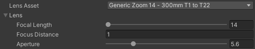
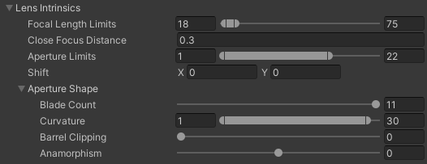

# Virtual camera lenses

### Lens controls

The current focal length (zoom), focus distance, and aperture (f-number) is controlled from [Virtual Camera Device](ref-component-virtual-camera-device.md) and the Virtual Camera app.

### Lens Intrinsics

Lens Intrinsics are defined on the lens preset in the [Lens Kit](ref-asset-lens-kit.md).

| Property                 | Function                                                     |
| :----------------------- | :----------------------------------------------------------- |
| **Focal Length Limits**  | The minumum and maximum focal length/zoom. This will be reflected in the app-side controls as well as the sliders on the Virtual Camera Device lens controls. |
| **Close Focus Distance** | The minimum focus distance for the Depth of Field. This will be reflected in the app-side controls as well as the sliders on the Virtual Camera Device lens controls. |
| **Aperture Limits**      | The minimum and maximum Apertures (f-numbers). This will be reflected in the app-side controls as well as the sliders on the Virtual Camera Device lens controls. |
| **Shift**                | Set the horizontal and vertical shift from the center. Values are  multiples of the sensor size; for example, a shift of 0.5 along the **X** axis offsets the sensor by half its horizontal size.  You can use lens  shifts to correct distortion that occurs when the Camera is at an angle  to the subject (for example, converging parallel lines). |
| **Aperture Shape**       |                                                              |
| Blade Count      | Use the slider to set the number of diaphragm blades the Camera uses to form the aperture. This property affects the look of the Depth of Field bokeh. |
| Curvature       | Use the remapper to map an aperture range to blade curvature. Aperture blades become more visible on bokeh at higher aperture values. Tweak this range to define how the bokeh looks at a given aperture. The minimum value results in fully-curved, perfectly-circular bokeh, and the maximum value results in fully-shaped bokeh with visible aperture blades. This property affects the look of the Depth of Field bokeh. |
| Barrel Clipping       | Use the slider to set the strength of the “cat eye” effect. You can see this effect on bokeh as a result of lens shadowing (distortion along the edges of the frame). This property affects the look of the Depth of Field bokeh. |
| Anamorphism       | Use the slider to stretch the sensor to simulate an anamorphic look. Positive values distort the Camera vertically, negative values distort the Camera horizontally. This property affects the look of the Depth of Field bokeh and the Bloom effect if you enable its Anamorphic property. |
