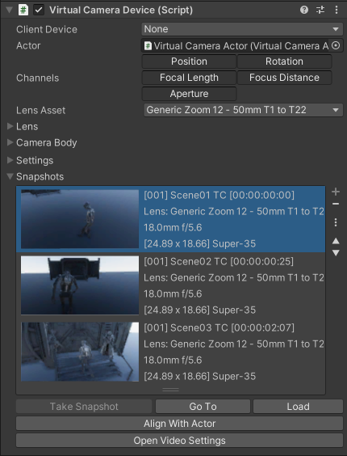

# Using Virtual Camera Snapshots

Use Snapshots to capture the current state of your Virtual Camera and reuse it later.

The information stored in a Snapshot includes the current camera position, rotation, and other metadata such as the physical camera properties and Timeline clip information, when available. It also includes a screenshot of the current camera view for visual reference.

>**Note:** To take and reuse Snapshots, you must have first set up a connection between the Virtual Camera app and the Unity Editor.

## Accessing the Snapshots management interface

>**Note:** The Snapshots feature is only available from the Virtual Camera Device in the Unity Editor. There is currently no interface to manage Snapshots from the Virtual Camera app.

To access the Snapshots management interface in the Unity Editor:

1. In the Hierarchy, select the VirtualCameraDevice GameObject.
2. In the Inspector, in the [Virtual Camera Device](ref-component-virtual-camera-device.md) component, expand the Snapshots section.

## Taking a Snapshot

To take a Snapshot, click on **Take Snapshot** at the bottom of the list.

You should see a new entry displayed in the Snapshot list, represented by a thumbnail of the camera view, along with metatdata like the shot name, timecode, lens information, and sensor size.

## Using a Snapshot to reposition the camera

To reposition your camera according to the position and rotation captured through a Snapshot, select the Snapshot and click **Go To**.

>**Note:** This action doesn't restore any other metadata from the Snapshot, such as lens and clip information.

## Restoring the full camera state from a Snapshot

To restore all metadata captured through a Snapshot and apply them to your camera, including its position, rotation, physical camera properties, and Timeline clip information (when available), select the Snapshot and click **Load**.

## Additional information

* [Virtual Camera Device component: Snapshots (UI reference)](ref-component-virtual-camera-device.md#snapshots)
* [Project Settings: Snapshots](ref-project-settings-snapshots.md)
